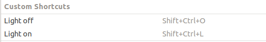
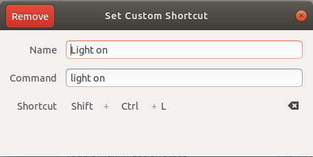
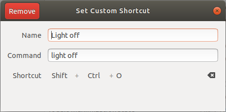

# Elgato Key light mini controller

This was a program built out of laziness as I wanted a quicker way to control my elgato key light mini that I use for zoom calls. It makes rest calls to the api on the light and has a rudimentary cli.

## Building

If you are reading this, I still haven't gotten around to adding bonjur support for auto discovery. So you will need to manually edit this line with your light's IP address:
```go
const LIGHT_IP = "192.168.4.40"
```
You will have to find it in your router / access point's web interface, then make sure to re-build. Eventually I should make this work with bonjur, but thats a later problem.

Build with `go build` and put on your path somewhere for easy access

## Usage

`light --help` for all commands and their usage. Copied here below for easy access

```
# light --help
Usage: light <command>

Flags:
  -h, --help    Show context-sensitive help.

Commands:
  on
    Turn light On

  off
    Turn light Off

  warmer
    Increase color temperature

  cooler
    Decrease color temperature

  brighter
    Increase brightness

  dimmer
    Decrease brightness

Run "light <command> --help" for more information on a command.
```

## Ultra Lazy Mode

Tired of having to open a terminal and type in a command to turn on your light? Why not create a shortcut?

In ubuntu 18.04 (no idea about other os versions, google it) you can create keyboard shortcuts from the settings menu (settings->devices->keyboard). I created 2 shortcuts to run the `light on` and `light off` commands, that way when I forget I have a meeting and am scrambling to find the link I can at least not stress about my light turning on. Below are some screenshots of my shortcut configs.



